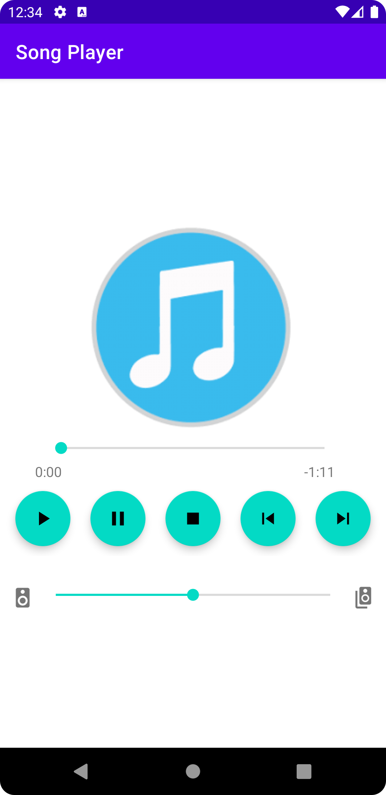

# Music Player
The aim of this project was to get acquainted with audio files managemant. For this purpose the Music Player 
application was implemented to play and manage the music track.
## Table of Contents
* [General Info](#general-information)
* [Technologies Used](#technologies-used)
* [Features](#features)
* [Screenshots](#screenshots)
* [Setup](#setup)
* [Project Status](#project-status)
* [Room for Improvement](#room-for-improvement)
* [Contact](#contact)

## General Information
The application allows to play the music. Inside the app the user can easily regulate the volume as well as the part of a song using seekbar, 
stop and play the track again, play the previous or next song using clicking the right button. The app works in the background.  

## Technologies Used
- Material Design 1.2.1
- Kotlin 1.4.2

## Features
List the ready features here:
* playing songs
* pausing songs
* playing the previous or next track
* regulating volume 
* controling playback duration
* the app works in the background

## Screenshots
Application screenshot review

### Main screen 

  

## Setup
1. Download the samples by cloning this repository
2. In the welcome screen of Android Studio, select "Open an Existing project"
3. Select one of the sample directories from this repository

Alternatively, use the `gradlew build` command to build the project directly

## Project Status
Project is: _no longer being worked on_

## Room for Improvement
To do:
* change app design
* add list with available songs

## Contact
Created by [@HKonstanty](https://github.com/HKonstanty/HKonstanty) - feel free to contact me!